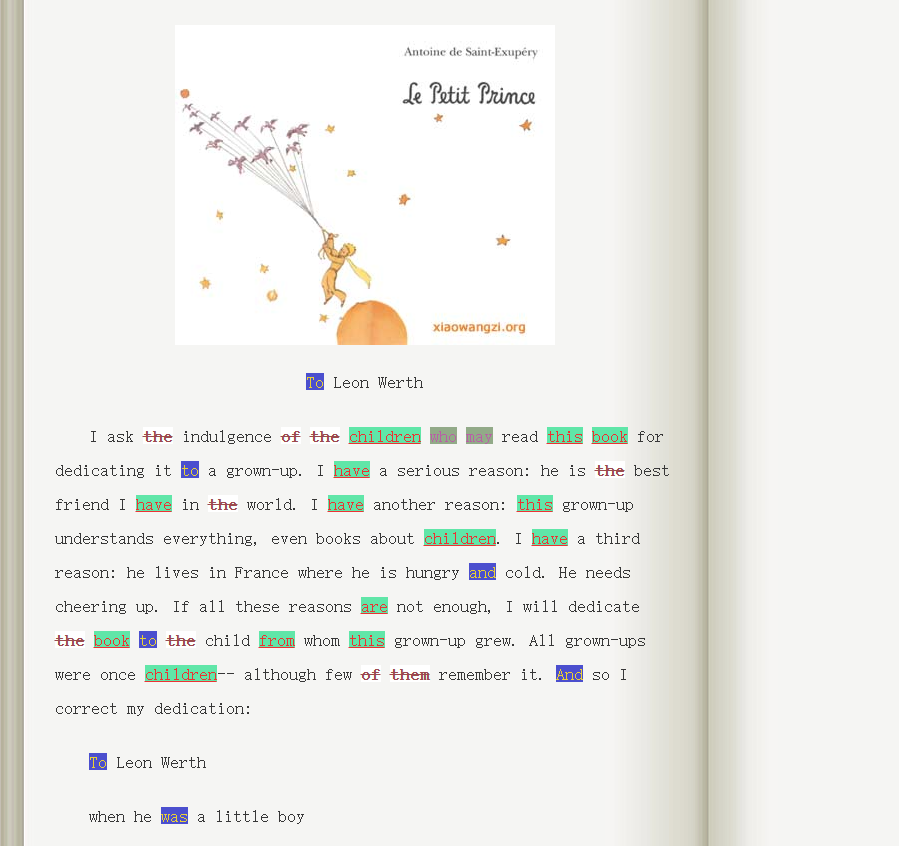

## 项目介绍

一个使用ChatGPT开发的Chrome网页单词标注扩展

## 功能说明

#### 单词列表管理：

- 添加新列表：通过选项页面创建新的单词列表。
- 编辑列表：自定义列表的名称、单词、匹配规则和高亮样式。
- 删除列表：清理不需要的单词列表。
- 导入/导出：支持 JSON 文件的导入和导出，方便备份和共享单词列表。

#### 单词高亮：

- 自动高亮：在网页加载时，根据启用的列表自动高亮匹配的单词。
- 多样式支持：为不同列表配置字体颜色、背景颜色、加粗、下划线等样式。

#### 右键添加单词：

- 右键选中网页中的单词，通过菜单添加到特定的单词列表中。

#### 云同步（可选）：

在多个设备间同步您的单词列表数据（存储限制约 100 KB）。

## 示例效果

## TODO

- 词形还原匹配
- 根据词性高亮，如动词的突出显示
- 当鼠标移动到高亮词时显示单词的笔记内容
- 一键禁用高亮
- 快捷键支持
- 选择在哪些网页上启用高亮
- 仿生阅读支持
- 仿生阅读支持词根模式
- 添加默认词表，常见单词分级词表
- 添加单词显示饱和度样式，常见词熟悉词使用低饱和度
- 添加更多样式
- 添加词组匹配
- 反相高亮功能

## 更新记录

- v0.1 初始化项目

    能够正确高亮各个列表单词，popup界面和管理界面不够美观

- v0.2 细节优化
- v0.3 右键菜单实时更新
- v0.4 UI美化
- v0.5 添加词表导入导出
- v0.6 BUG修复，初步发布版本
- v0.7.0 代码结构重构，修复单词管理界面逻辑，减少扩展权限请求

## 开源地址

https://github.com/httogo/wordlist-highlight.git
